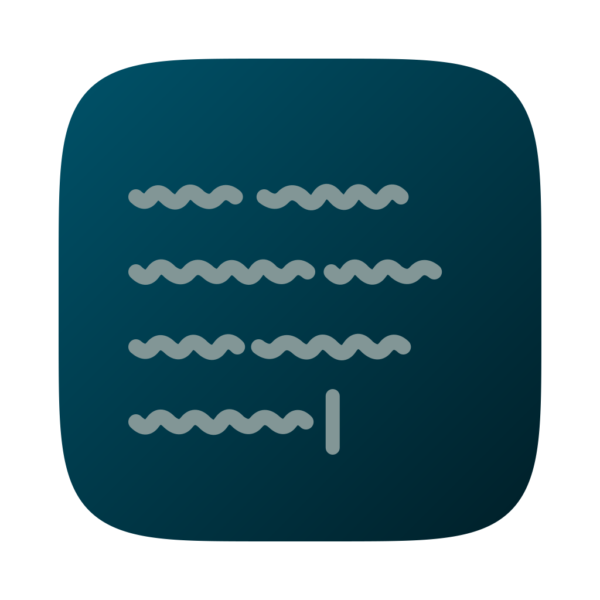

FromScratch
===========

## A simple but smart note-taking app

FromScratch is a little app that you can use as a quick note taking or todo app.

* Small and simple, the only UI is the text you type
* Saves on-the-fly, no need to manually save
* Automatic indenting
* Note-folding
* Use checkboxes to keep track of your TODO's
* Powerful keyboard control
* Replaces common syntax with symbols, such as arrows
* Dark and Light theme
* Portable mode support
* Free

> This is a fork of [buzkall/fromscratch](https://github.com/buzkall/fromscratch), which is itself a
> fork of the original [Kilian/fromscratch](https://github.com/Kilian/fromscratch) by
> [Kilian Valkhof](https://kilianvalkhof.com). buzkall did the work of getting the app building and
> running on current macOS; this fork adds an Apple Silicon build pipeline and a new app icon.
> See [Fork notes](#fork-notes) for what changed at each step.

### Shortcuts

* `f1` - show/hide shortcut overview
* `cmd/ctrl+up` - move current line up
* `cmd/ctrl+down` - move current line down
* `cmd/ctrl+d` - delete current line
* `cmd/ctrl+z` / `shift+cmd/ctrl+z` - undo / redo
* `cmd/ctrl+w/q` - close application
* `cmd/ctrl +/=` - zoom text in
* `cmd/ctrl -` - zoom text out
* `cmd/ctrl+0` - reset text size
* `cmd/ctrl+]/[/k` - fold note collapsing
* `cmd/ctrl+f` - search (toggle `.*` in the search panel for regular expressions)
* `shift+cmd/ctrl+f` - replace
* `shift+cmd/ctrl+r` - replace all
* `cmd/ctrl+g` - jump to line (you can also use `line:character` notation)
* `cmd/ctrl+/` or `cmd/ctrl+l` - Add or toggle a checkbox
* `f11` - Toggle fullscreen
* `cmd/ctrl+i` - Toggle between light and dark theme
* `alt` - show or hide menu (Windows only)
* `cmd/ctrl+s` - ...this does nothing.

## Development

`package.json` allows Node 20.19+. `.nvmrc` pins **24**, which is what CI builds against.

```sh
# Install dependencies
npm install

# Run in development (hot reloading renderer, devtools open)
npm run dev

# Build without packaging
npm run build

# Build and package a macOS arm64 .dmg into release/
npm run package:mac

# Lint / format
npm run lint
npm run format
```

`npm run dev` stores its data in `~/.fromscratch/dev`, so development never touches real notes.

### Installing your build

`npm run dev` runs from source; the app in `/Applications` is a frozen bundle. To pick up source
changes there, repackage and copy it over:

```sh
npm run package:mac
cp -R release/mac-arm64/FromScratch.app /Applications/
```

Quit the app first, and don't run it alongside `npm run dev` — both write the same
`~/.fromscratch/content.txt`.

The `fromscratch` Homebrew cask no longer exists, but if you installed it years ago the old bundle
may still be around and will collide with this one on the same file name. Remove it if so:

```sh
brew uninstall --cask fromscratch
```

Builds are **unsigned**: they run fine when built and used locally. If a build ever gets
quarantined (for instance after being downloaded), clear it with:

```sh
xattr -dr com.apple.quarantine /Applications/FromScratch.app
```

Signing and notarizing would need a paid Apple Developer Program membership ($99/year) for a
Developer ID Application certificate — a free Apple ID gets a Personal Team, which cannot issue one
and cannot notarize. On the build side electron-builder 26 handles it natively: set `mac.identity`,
`mac.hardenedRuntime` and `mac.notarize` in `electron-builder.yml`. No `@electron/notarize`
afterSign hook is needed any more. Electron additionally needs the `com.apple.security.cs.allow-jit`
and `allow-unsigned-executable-memory` entitlements to launch under the hardened runtime.

### Command Line Arguments
**Portable Mode**
`--portable`

Lets you store all the files FromScratch generates in a specified location, such as a USB-stick or
other portable storage device. In this mode both the configuration files as well as your text content will be stored in
a "userdata" directory alongside the FromScratch executable, or when given a directory as an argument, will store
the files there.

You can also use this to store the FromScratch configuration files, and the text content, in a synced cloud storage
folder.

```
# run FromScratch in portable mode, saving data in application directory.
fromscratch --portable
```

```
# run FromScratch in portable mode, saving data in custom directory.
fromscratch --portable ~/fromscratch_data
```
**help**
`-h, --help`

Prints help information

### FAQ
*Where is my data saved?*

Your data is saved in a plain text file content.txt. On Mac and Linux, this file is saved in ~/.fromscratch. On Windows
this file is saved in a directory called ".fromscratch" in your userprofile directory.

*Can my data be saved in an alternate directory?*

Yes! See the **portable mode** section under the **Command Line Arguments** heading above.

## Fork notes

### Modernisation, by [buzkall](https://github.com/buzkall/fromscratch)

The original project stopped at Electron 4 / webpack 4 / Babel 6 / node-sass, which no longer
installs or builds on current Node and macOS. buzkall kept the app and its data format identical
while replacing everything underneath, and that work is inherited wholesale here:

* **electron-vite + Vite** instead of webpack, Babel and the DLL build
* **Electron 43**, built for Apple Silicon, with `contextIsolation`, `sandbox` and a preload
  bridge instead of the removed `remote` module
* **React 19** function components
* **CodeMirror 6** instead of CodeMirror 5 and the unmaintained `react-codemirror`. Indentation
  folding, checkbox toggling and the fold persistence are reimplemented in `src/renderer/src/editor`
* **Plain CSS** with custom properties instead of Sass
* macOS vibrancy uses `under-window` driven by `nativeTheme` (`ultra-dark`/`medium-light` were
  removed in Electron 27)
* Shortcuts come from the menu and the editor keymap instead of OS-wide `globalShortcut`
  registrations
* Content is written to disk debounced instead of on every keystroke
* The update check looks at a fork's GitHub releases rather than the original's

The on-disk format is unchanged: `~/.fromscratch/content.txt` plus the settings files next to it.
Folds are stored under a new `folds2` key, so the old `folds` file is simply ignored.

### Changes in this fork

* **New app icon** on the macOS squircle grid. The previous icon was a sharp-cornered square with
  window dots floating outside it — a shape macOS 26 shrinks onto a grey squircle background rather
  than displaying as-is. The replacement keeps the same idea (scribbled lines and a text caret) on
  the 824×824-at-100,100 grid Apple's own icons use
* The icon is **rendered from SVG**, not drawn by hand in a bitmap editor. `resources/icon-src`
  holds a generator script and the vector sources; `./build-icns.sh` regenerates `icon.icns` and
  `icon.png` reproducibly. The artwork was **designed with LLM assistance** (Claude), including the
  stroke geometry and the measurement of Apple's icon grid — see
  [`resources/icon-src/README.md`](resources/icon-src/README.md) for how the geometry was derived
* Layered SVGs are included for **Icon Composer**, so the Liquid Glass `.icon` for macOS 26 can be
  assembled without redrawing anything. That step needs Tahoe 26.4 and Xcode 26, so only the
  `.icns` is built here
* **GitHub Actions workflow** building and linting on every push, and publishing an arm64 `.dmg` to
  a GitHub release on `v*` tags
* App id is `com.jkotzker.fromscratch`, and the repository, issue, release and update-check URLs
  point at this fork

Releases are **unsigned** — there is no paid Apple Developer account behind this fork. A dmg you
download will be quarantined, and macOS Sequoia and later removed the Control-click shortcut for
that, so it has to be allowed under System Settings → Privacy & Security. Building locally avoids
the problem entirely, since an app you build yourself is never quarantined.

### Credits

FromScratch is built upon these open source projects:
	<a href="https://electronjs.org">Electron</a>,
	<a href="https://react.dev">React</a>,
	<a href="https://github.com/tonsky/FiraCode">Fira Code</a>,
	<a href="https://codemirror.net">CodeMirror</a> and
	<a href="https://github.com/chentsulin/electron-react-boilerplate">Electron-react-boilerplate</a>.

Original app by [@kilianvalkhof](https://kilianvalkhof.com). Thanks to @bittersweet for helping set
up IPC to work around a particularly nasty bug, @chentsulin for the electron-react-boilerplate, and
@ctrauma for the portable bits.

The port to a current toolchain — electron-vite, Electron 43, React 19 and CodeMirror 6 — is
[@buzkall](https://github.com/buzkall)'s work, and this fork is built directly on top of it.

MIT licensed throughout, as the original is.
